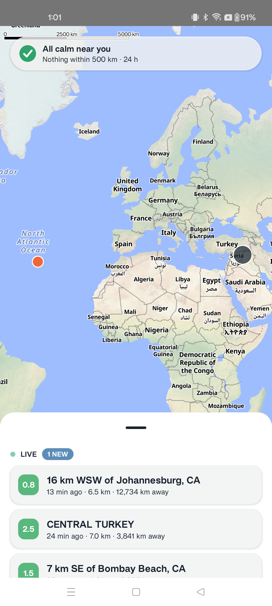
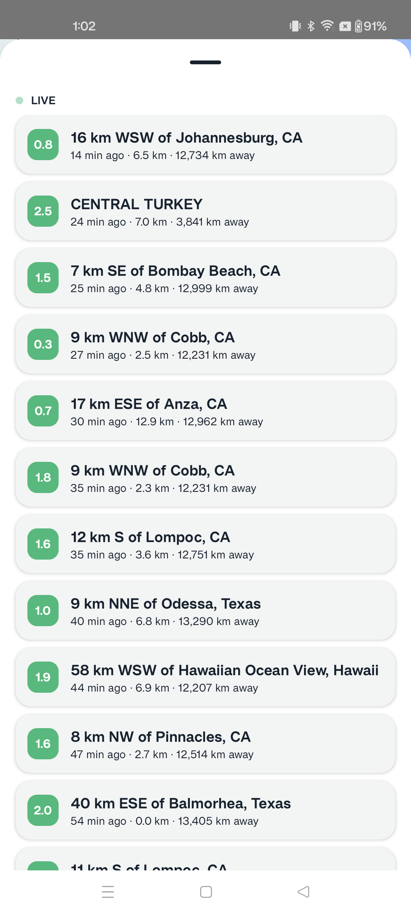
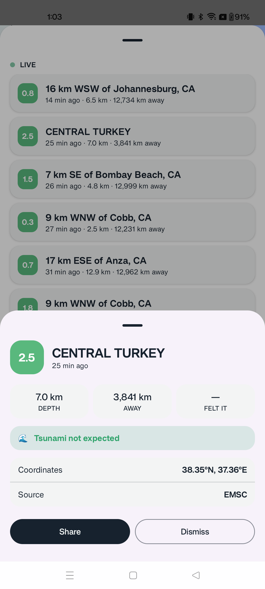

# TerraWatch

Live earthquake monitor. Kotlin Multiplatform + Compose Multiplatform (Android · Desktop · Web).

Data: USGS realtime feeds + FDSN archive, EMSC WebSocket live stream. Free APIs, no keys.

## Run
- Desktop: `./gradlew :composeApp:run`
- Android: `./gradlew :composeApp:assembleDebug` (or Run in Android Studio)
- Web: `./gradlew :composeApp:wasmJsBrowserDevelopmentRun`

## Test
`./gradlew :core:model:jvmTest :core:network:jvmTest :core:database:jvmTest :core:data:jvmTest :core:ui:jvmTest :composeApp:jvmTest`

Note: corporate TLS-intercepting proxies require the proxy root CA in the JVM truststore for live-data runs; tests use recorded fixtures and MockEngine — no network needed.

## Screenshots

| Map · Pins | Sheet · Expanded | Detail · Real Quake |
|---|---|---|
|  |  |  |

**Features:** Live map with magnitude-banded pins + clustering. Live EMSC WebSocket + USGS polling with deduplication. Status pill showing connection state. Feed sheet with recent events. Detail sheet with revision history. Dark mode support. Offline cache. Adaptive desktop two-pane layout. Web wasm placeholder.

## Live data behind corporate proxies

TerraWatch fetches live earthquake data from public USGS and EMSC APIs. In TLS-intercepting proxy environments (e.g., corporate Zscaler), both desktop and Android debug builds can trust user-installed CA certificates.

### Desktop (JVM)
1. Obtain the corporate proxy root CA (e.g., `zscaler-root-ca.pem`).
2. Import into the JVM truststore:
   ```bash
   keytool -import -alias zscaler-root-ca -file /path/to/zscaler-root-ca.pem \
     -keystore ~/.gradle/zscaler-truststore.jks -storepass changeit
   ```
3. Run with the custom truststore:
   ```bash
   JAVA_TOOL_OPTIONS="-Djavax.net.ssl.trustStore=$HOME/.gradle/zscaler-truststore.jks \
     -Djavax.net.ssl.trustStorePassword=changeit" ./gradlew :composeApp:run
   ```

### Android debug build
1. Build the debug APK (which trusts user-installed CAs):
   ```bash
   ./gradlew :composeApp:assembleDebug
   ```
2. Push the proxy root CA to the emulator or device:
   ```bash
   adb -s emulator-5554 push /path/to/zscaler-root-ca.pem /sdcard/Download/zscaler.pem
   ```
   (Replace `emulator-5554` with your device serial if needed.)
3. On the device, install the certificate as a user CA:
   - **Settings** → **Security** → **Encryption & credentials** → **Install a certificate** → **CA certificate**
   - Select `/sdcard/Download/zscaler.pem`
4. After installation, the debug build will trust the user-installed proxy CA.

### Release builds and tests
- **Release builds** trust only system certificate authorities and are not affected by debug-only CA configuration.
- **Unit and integration tests** use recorded API fixtures and mock HTTP engines — they never require network access or corporate proxy configuration.

## Docs
- Spec: `docs/superpowers/specs/2026-08-08-terrawatch-design.md`
- Plans: `docs/superpowers/plans/`
