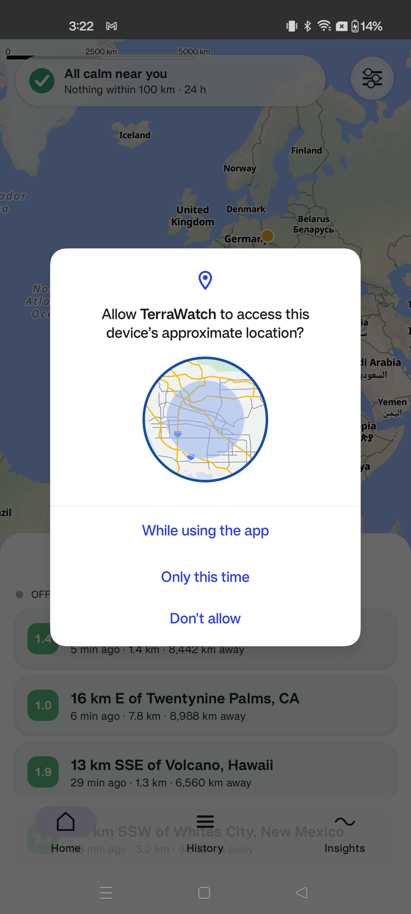
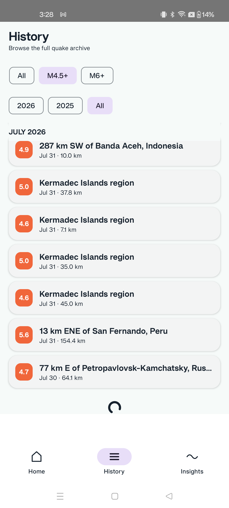
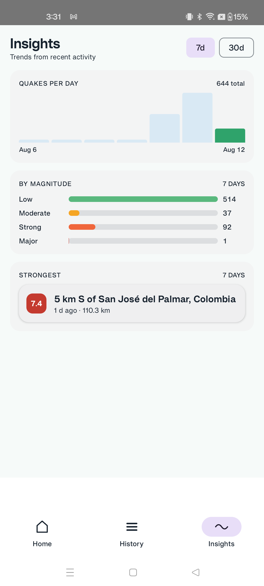
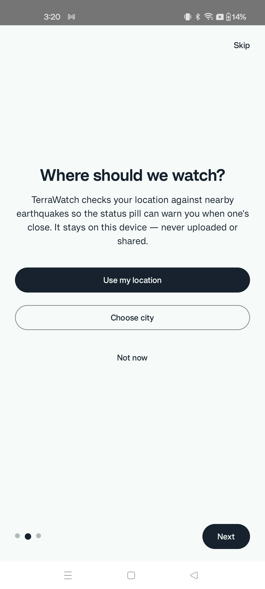
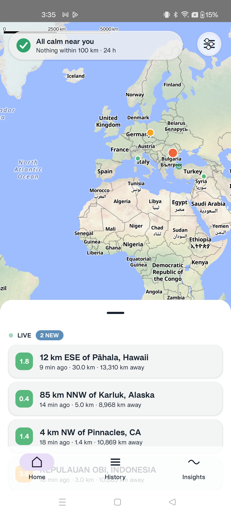
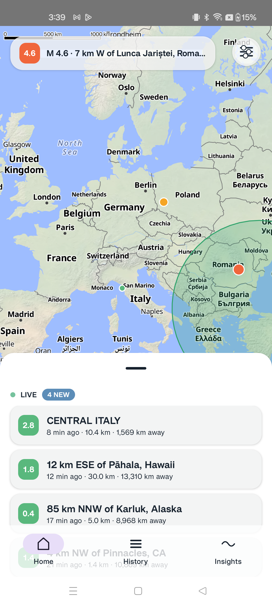

# TerraWatch

Live earthquake monitor. Kotlin Multiplatform + Compose Multiplatform (Android · Desktop · Web).

Data: USGS realtime feeds + FDSN archive, EMSC WebSocket live stream. Free APIs, no keys.

## Run
- Desktop: `./gradlew :composeApp:run`
- Android: `./gradlew :composeApp:assembleDebug` (or Run in Android Studio)
- Web: `./gradlew :composeApp:wasmJsBrowserDevelopmentRun`

## Test
`./gradlew :core:model:jvmTest :core:network:jvmTest :core:database:jvmTest :core:data:jvmTest :core:ui:jvmTest :composeApp:jvmTest`

Note: corporate TLS-intercepting proxies require the proxy root CA in the JVM truststore for live-data runs; tests use recorded fixtures and MockEngine — no network needed.

## Features

- **Live map:** Real-time earthquake pins color-coded by magnitude (CALM/ALERT colors). Clustering for crowded regions. Tap pins to detail sheet.
- **Status pill:** Live connection indicator (LIVE/Offline). Safety status based on nearby alerts (default 100km, configurable 50–1000km).
- **Feed sheet:** Recent earthquakes with magnitude, distance, and timestamps.
- **History archive:** Filterable archive (magnitude, year) with infinite scroll through the USGS/FDSN archive. Browse all quakes with month-group headers.
- **Insights:** Trends from recent activity (7d/30d views). Daily event count chart, magnitude distribution, strongest quake link-to-detail.
- **Settings:** Adjust nearby radius 50–1000km (live ring on map). Theme switcher (System/Light/Dusk). Launch permission flow.
- **Onboarding:** 3-step walkthrough (earthquake intro, location opt-in with city picker, default alert rule explanation). Skip anytime.
- **Detail sheet:** Full quake data with revision history. Links to USGS. Magnitude badge, distance, time. Accessible TalkBack support.
- **Data:** USGS realtime feeds + FDSN archive API + EMSC WebSocket stream. Free APIs, no keys. Cross-agency dedupe. Offline cache.
- **Accessibility:** TalkBack labels on all interactive elements. Magnitude badges, status pill, live indicator, navigation tabs. Reduced-motion support.
- **Dark mode:** System/Light/Dusk theme. Adaptive Calm Guardian design system.
- **Platforms:** Android (real-time). Desktop + Web deferred (compiles green; runtime polish deferred to Plan 4).

## Screenshots

| Cold start: live map + status pill | History archive with filters | Insights trends + strongest detail |
|---|---|---|
|  |  |  |

| Onboarding walkthrough | Settings radius 100km ring | Cluster tap-zoom & labels |
|---|---|---|
|  |  |  |

See `docs/qa/plan-3-device-matrix/` for full device verification matrix (31 screenshots, real device 98bc1cd8).

## Architecture

Kotlin Multiplatform, 6 modules: `core:model` (domain types) → `core:network` (USGS + EMSC clients) / `core:database` (SQLDelight) → `core:data` (repository, dedupe, alerts) → `core:ui` (Calm Guardian design system) → `composeApp` (Compose Multiplatform screens; Android/desktop/wasm targets — live MapLibre map on Android, fallback panes elsewhere). All logic modules are Compose-free and tested as plain JVM.

## Live data behind corporate proxies

TerraWatch fetches live earthquake data from public USGS and EMSC APIs. In TLS-intercepting proxy environments (e.g., corporate Zscaler), both desktop and Android debug builds can trust user-installed CA certificates.

### Desktop (JVM)
1. Obtain the corporate proxy root CA (e.g., `zscaler-root-ca.pem`).
2. Import into the JVM truststore:
   ```bash
   keytool -import -alias zscaler-root-ca -file /path/to/zscaler-root-ca.pem \
     -keystore ~/.gradle/zscaler-truststore.jks -storepass changeit
   ```
3. Run with the custom truststore:
   ```bash
   JAVA_TOOL_OPTIONS="-Djavax.net.ssl.trustStore=$HOME/.gradle/zscaler-truststore.jks \
     -Djavax.net.ssl.trustStorePassword=changeit" ./gradlew :composeApp:run
   ```

### Android debug build
1. Build the debug APK (which trusts user-installed CAs):
   ```bash
   ./gradlew :composeApp:assembleDebug
   ```
2. Push the proxy root CA to the emulator or device:
   ```bash
   adb -s emulator-5554 push /path/to/zscaler-root-ca.pem /sdcard/Download/zscaler.pem
   ```
   (Replace `emulator-5554` with your device serial if needed.)
3. On the device, install the certificate as a user CA:
   - **Settings** → **Security** → **Encryption & credentials** → **Install a certificate** → **CA certificate**
   - Select `/sdcard/Download/zscaler.pem`
4. After installation, the debug build will trust the user-installed proxy CA.

### Release builds and tests
- **Release builds** trust only system certificate authorities and are not affected by debug-only CA configuration.
- **Unit and integration tests** use recorded API fixtures and mock HTTP engines — they never require network access or corporate proxy configuration.

## Docs
- Spec: `docs/superpowers/specs/2026-08-08-terrawatch-design.md`
- Plans: `docs/superpowers/plans/`
