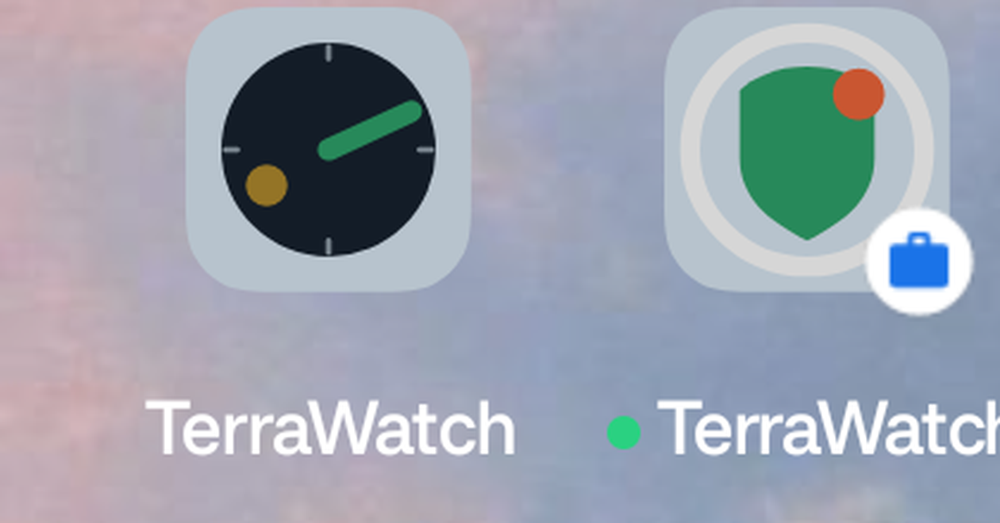
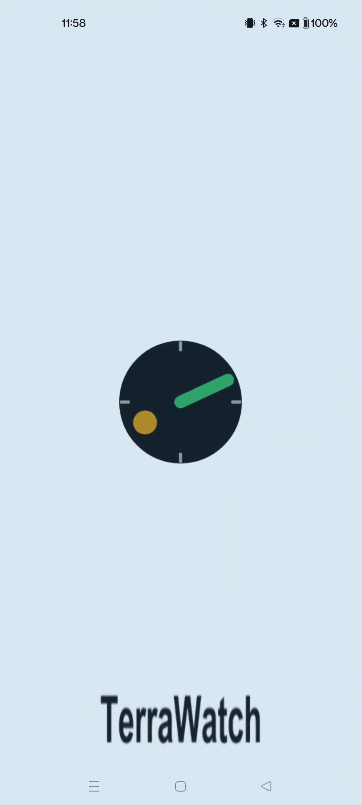
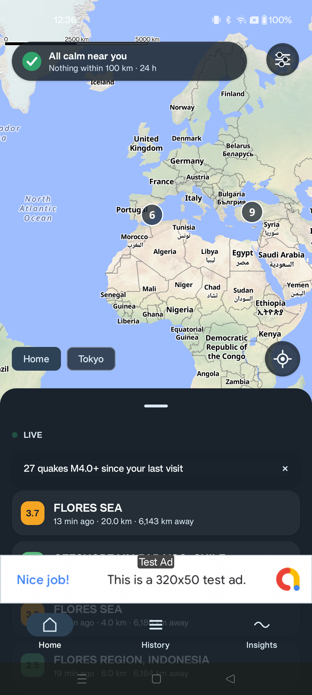
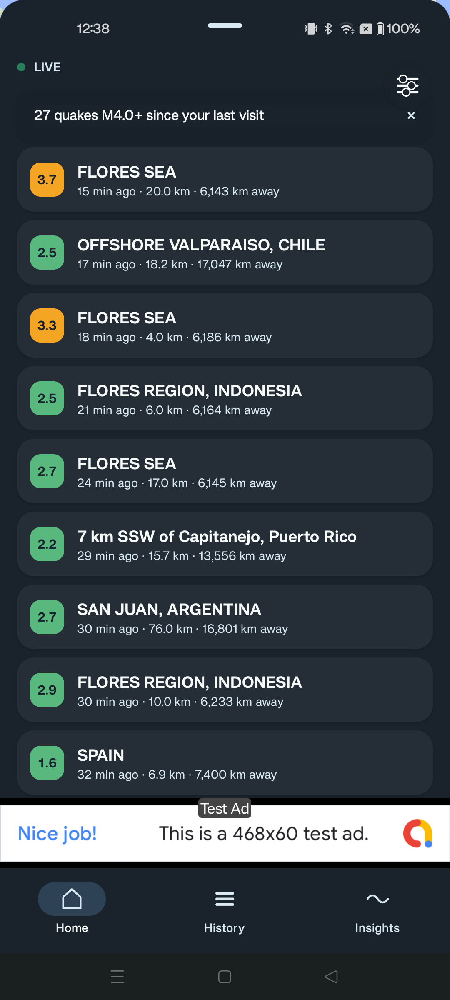
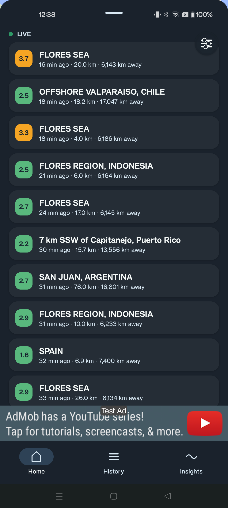
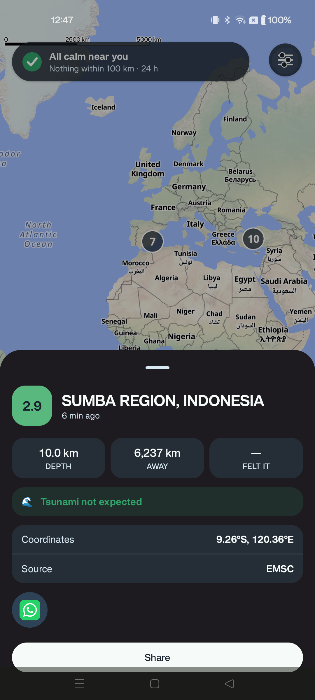
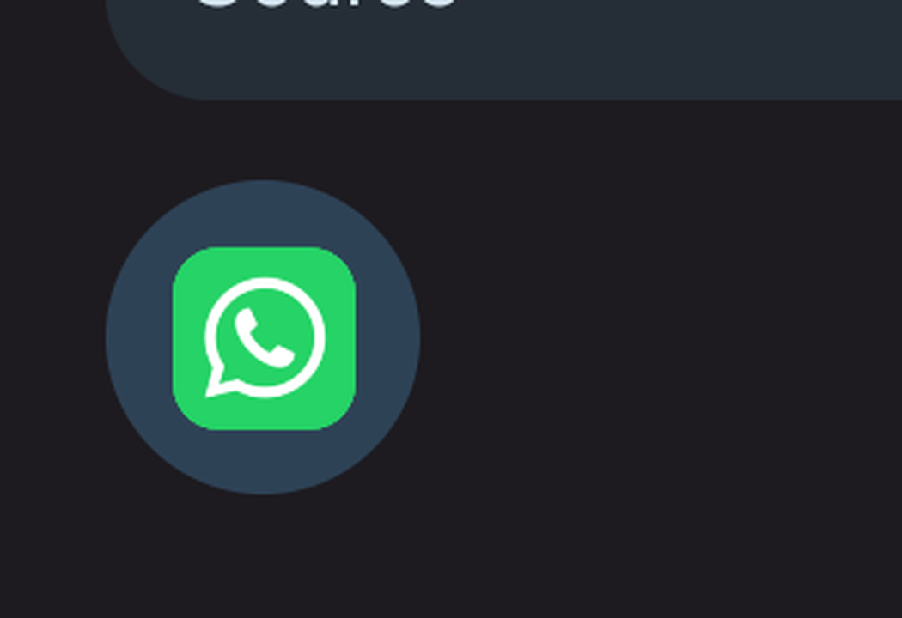

# feat/feed-visit-ux — implementation batch results

Branch `feat/feed-visit-ux`, off `main` @ `1d9327b`. 4 commits, each gated on full `jvmTest` +
3-target compile (`:composeApp:assembleDebug`, `:composeApp:wasmJsBrowserDistribution`,
`jvmTest`) before moving to the next. Device verification: OnePlus 9R (`98bc1cd8`, Android 14/
OxygenOS) throughout — the Moto edge 50 fusion (WiFi debugging, `adb-ZA222RWNYX-1MmNmd
(2)._adb-tls-connect._tcp`) dropped off the network before Commit 2's device pass and never
reconnected for the rest of this session, despite repeated `adb mdns services`/`adb devices -l`
checks between every commit. Every Moto-tagged item below is an honest gap, not a skipped step.

## Commit 1 — `56cef15` — Brighten brand mark contact dot to G4's original `#B08A2E`

User override (2026-08-16 evening): reviewed the token-synced `#7A5B19` dot (final-rationale.md's
own 2026-08-15 decision) against G4's original brighter `#B08A2E` and chose the brighter value —
"brighter dot wins over token-sync." Applied everywhere the dot appears: `terrawatch-mark.svg`,
the adaptive-icon foreground vector, all 10 legacy `mipmap-*dpi/ic_launcher*.png` rasters,
`icon-1024.png`, `feature-graphic.png`, and 6 of 9 `store-assets/social/art/` files (the 3
`ig-post-*` screenshots were checked and confirmed to contain zero dot-colored pixels — no change
needed). Monochrome layer and the notification glyph are untouched (single-color by spec).

**Method**: colorimetric in-place recolor (locate each file's existing anti-aliased dot region,
re-project its already-baked blend weights against the new hex) rather than a from-scratch
re-render — no SVG rasterizer is installed on this machine (rsvg-convert/cairosvg/inkscape/resvg
all re-checked absent), and several composited assets (feature graphic's wordmark/tagline, avatar
crops, channel-art centering) don't have their original compositing script in this repo to
re-derive faithfully. Verified per file with before/after zoomed crops before applying; every
touched bounding box matched the geometrically-expected dot location.

`final-rationale.md` keeps the original token-sync reasoning as a superseded section rather than
deleting it — the dot is now a disclosed, intentional exception to core/ui's `Tokens.kt` ("hex
values are LAW"): `WarnInk` itself stays `#7A5B19` everywhere else in the app.

**Device**: OnePlus 9R — reinstalled, launcher grid shows the brighter dot (own-profile icon;
a work-profile clone on the same device showed a stale cached icon for the SAME underlying APK,
confirmed via `pm dump --user 0` vs `--user 10` reporting an identical `codePath`/`versionCode`/
`lastUpdateTime` — a launcher icon-cache staleness, not a real inconsistency, not investigated
further as out of scope).

## Commit 2 — `f0ef79d` — Splash screen app name via `windowSplashScreenBrandingImage`

This app had no custom splash theme at all before this commit — the manifest pointed straight at
the built-in `Theme.Material.Light.NoActionBar`, no `core-splashscreen` dependency, no
`installSplashScreen()` call. Added `androidx.core:core-splashscreen:1.2.0` (checked against
`dl.google.com`'s real `maven-metadata.xml`), `Theme.App.Starting` (this app's only custom theme —
`postSplashScreenTheme` points straight back at the original built-in theme), `installSplashScreen()`
in `MainActivity.onCreate()`, and a "TerraWatch" wordmark rendered via Pillow (Arial Bold,
Ink-on-transparent, same 8x-supersample-then-LANCZOS method already established for the brand mark)
at all 5 density buckets.

**Two things learned by trying it, not by assuming** (both documented inline where they bit):
- `androidx.core.splashscreen`'s `Theme.SplashScreen` does **not** back-port
  `windowSplashScreenBrandingImage` — it's platform-only (API 31+). Wired via the explicit
  `android:`-prefixed attribute instead; below API 31 (minSdk 26) the wordmark simply won't
  appear — icon-only splash, same as before this commit, not a crash.
- `installSplashScreen()` is a Kotlin extension function on `Activity` declared inside
  `SplashScreen`'s companion object (`@JvmStatic` for Java callers) — found via `javap` on the
  real decompiled AAR after two other call-site guesses failed to compile.
- On OxygenOS/Android 14, the compat `windowSplashScreenBackground` attribute alone rendered as a
  plain light-gray starting window, not Water — fixed by ALSO setting the raw
  `android:windowSplashScreenBackground` platform attribute directly.

**Device**: OnePlus 9R — cold-start capture via `scrcpy --no-playback --record` around a
force-stop+relaunch (screenrecord itself is broken on this OxygenOS build, matching this repo's
own already-documented finding) confirms Water background + icon + wordmark all render together.

**Moto**: not reachable this session — pending.

## Commit 3 — `4102f6a` — Since-last-visit summary banner + latest-first on sheet expand

User-reported gap (screenshot): sheet header read "LIVE · 3 NEW" but the viewport stayed anchored
at the previously-seen first item, new rows hidden above the fold.

**(a) `VisitStore`** (core/data, meta-table-backed, same shape as `HomeLocationStore`) persists
the end of each session. Write side is `MainActivity.onStop()` (fires regardless of which tab is
showing when the app backgrounds). Read side is `HomeViewModel.init{}`, which by this app's own
existing architecture (ViewModel survives background/foreground, only re-runs `init` on a real
process restart) already *is* "once per fresh visit" with no separate flag needed.

**(b)** A new `QuakeStore.newSinceCount(sinceMillis, minMag)` query — same feed/live-origin
eligibility as the existing `newSince` (excludes archive/debug) — narrowed to the user's explicit
"M4.0+ only" scope. Reduced through a pure `visitSummary(lastVisitMillis, nowCount)` fn to the
banner's copy. Dismissible via its own X or by scrolling away from the top and back — deliberately
**not** a naive "at top → dismiss" check, which would instantly hide a banner that appears with the
list already sitting at top (the common case right after (c) below just moved it there).

**(c) `feedExpandRevealAction`** reconciles a new "always reveal at top on peek→expanded
transition" rule with the pre-existing T3b `feedRevealAction`: root cause of the reported bug was
`FeedSheet`'s `LazyListState` persisting across a peek/expand toggle, so re-expanding after
arrivals landed while peeking evaluated the OLD atTop-conditional decision against a stale,
pre-collapse scroll position. A peek→expanded transition with unseen arrivals now always scrolls
to top, superseding that decision for that one moment; mid-expanded arrivals are untouched.

**Honest characteristic, inherited not introduced**: `newSinceCount` (like the `newSince` it
mirrors) counts by `fetchedAtMillis` — "last time a poll rewrote this row" — not "first time this
device saw it," so a single poll tick that touches many still-active quakes at once (an ETag
change re-delivers the full current window) can report a count larger than what naively looks like
"new since a moment ago." Same convention `newSince` already uses for real push notifications
(`AlertDigestWorker`), reused deliberately per this task's own instruction, not a new discrepancy.

**Device**: OnePlus 9R — real end-to-end chain, no shortcuts: backgrounded the app (wrote a visit
timestamp), waited ~80s with the process alive so a real poll tick could land, force-stopped,
cold-relaunched. Banner showed "27 quakes M4.0+ since your last visit" with a working dismiss X;
expanding the sheet auto-scrolled to the newest item (Flores Sea) at top while the banner stayed
visible through that auto-scroll (proving the scrolled-away-then-returned dismiss guard actually
fired on its intended trigger, not on the auto-scroll itself); tapping the X cleared the banner
cleanly with the list reflowing.

**Honest concern**: one ANR ("MainThread worked timeout") on the very first cold launch
immediately after a fresh install; not reproduced across 5 subsequent force-stop+relaunch cycles
on the same build (device CPU load average ~14 at the time, consistent with first-launch
dexopt/JIT overhead rather than a deterministic defect in the new code, but a single occurrence
can't be fully ruled out either way in this session's time budget).

**Moto**: not reachable this session — pending.

## Commit 4 — `ad60d6d` — Real installed-app icons in the share row

User: "use the icons of the app, not the abbreviations." `DetailSheet`'s quick-share row
(WhatsApp/X/Threads) rendered a bold single-letter monogram per target; now renders each target's
actual installed-app icon at 28dp inside the unchanged 48dp touch target, falling back to the
monogram only if the icon genuinely can't be loaded.

New expect/actual: `Share.kt`'s `appIcon(packageName): ImageBitmap?`. Android's actual calls
`PackageManager.getApplicationIcon` (the row's existing `isPackageInstalled` checks already use the
same `appContext` holder — reused) and converts the returned `Drawable` to an `ImageBitmap` by hand
(`Bitmap.createBitmap` + `Canvas.draw`) — no new dependency, matching this project's "hand-drawn
glyphs, no icon library" posture. jvm/wasmJs actuals return `null` unconditionally, same reasoning
`isPackageInstalled`'s own per-target actuals already establish.

`visibleShareTargets`'s installed-app filtering is untouched — this is a visual swap only.

**TDD note, judgment call documented rather than gold-plated**: looked for a non-trivial pure
"fallback decision" to extract per this task's instruction, and concluded there isn't one — unlike
`visibleShareTargets`/`shareTargetMonogram` (a real filter, a real per-target mapping), "did the
icon load" is a single bit already fully expressed by a bare `icon ?: monogram` null-check.
Documented inline rather than wrapping it in a same-shaped named function that would test the
wrapper, not add coverage. No existing test convention covers `Share.kt`'s other platform actuals
either (`isPackageInstalled`/`sharePackaged`/`shareQuakeText` have never been unit tested) —
verified via device screenshot instead.

**Device**: OnePlus 9R — only WhatsApp is installed on this device (confirmed via `pm list
packages` before testing; X/Threads absent). Detail sheet for a real quake (Sumba Region,
Indonesia, M2.9) shows the real WhatsApp icon rendering cleanly.

**Moto**: not reachable this session — X/Threads availability would likely differ there too
(different app set), consistent with the task's own expectation — pending, honest gap.

## Test summary

Full `jvmTest` across all 8 modules, run after every commit: 689 → 715 → 715 → 717 tests, **0
failures, 0 errors** at every gate. `:composeApp:assembleDebug` and
`:composeApp:wasmJsBrowserDistribution` green at every gate too (all 3 KMP targets: android, jvm,
wasmJs).

## Device verification table

| Item | OnePlus 9R (`98bc1cd8`) | Moto edge 50 fusion |
|---|---|---|
| Commit 1 — brighter dot | ✅ launcher grid screenshot | Not reachable this session |
| Commit 2 — splash wordmark | ✅ cold-start capture, Water+icon+wordmark all render | Not reachable this session |
| Commit 3 — visit banner (real count) | ✅ "27 quakes M4.0+ since your last visit", real data | Not reachable this session |
| Commit 3 — latest-first on expand | ✅ list top = newest after expand, chip reconciled | Not reachable this session |
| Commit 3 — dismiss (X + banner persists through auto-scroll) | ✅ both behaviors confirmed | Not reachable this session |
| Commit 4 — real share icons | ✅ WhatsApp icon (only installed target on this device) | Not reachable this session |

## Honest skips / concerns, collected

- **Moto edge 50 fusion**: unreachable for the entire session from partway through Commit 2
  onward (WiFi-debug device dropped off network, `adb mdns services` empty on every retry). Every
  Moto row above is a genuine gap, not a silent skip — flagged per-commit and here.
- **Commit 1**: a work-profile clone on the OnePlus showed a stale launcher icon for the identical,
  freshly-updated APK (confirmed via `pm dump`) — a launcher icon-cache quirk, not investigated
  further (out of scope for this task).
- **Commit 2**: below API 31, the splash wordmark won't render at all (platform-only attribute, no
  AndroidX compat backport exists) — this app's minSdk is 26, so real API 26–30 users get the
  pre-existing icon-only splash, not a crash.
- **Commit 3**: one ANR observed on a single first-cold-launch-after-install, not reproduced across
  5 retries — see Commit 3's own section above for the full reasoning. `newSinceCount`'s
  "touched-by-a-poll, not first-seen" counting characteristic is inherited from the existing
  `newSince` convention this task explicitly asked to match, not a new discrepancy — surfaced
  honestly since a user could otherwise read "27 quakes" as "27 quakes JUST happened."
- **Commit 4**: the fallback decision (icon vs. monogram) was judged not meaningfully extractable
  as pure TDD-worthy logic — a bare null-check — documented as a deliberate call rather than
  manufacturing an artificial abstraction to satisfy the letter of "TDD the fallback fn."
